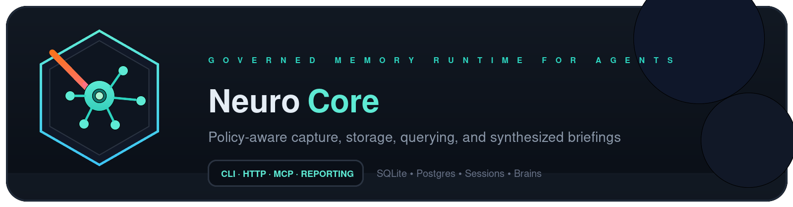
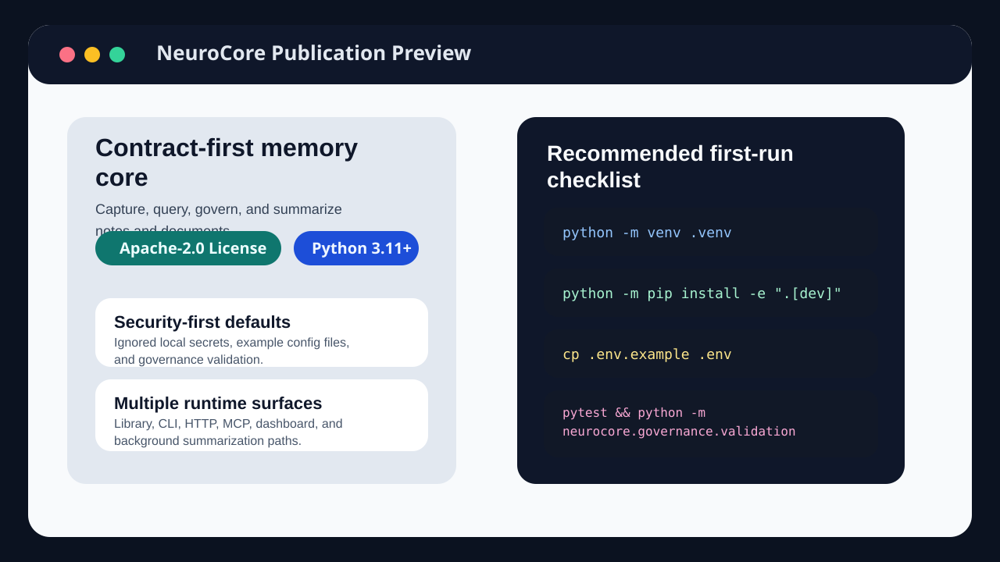
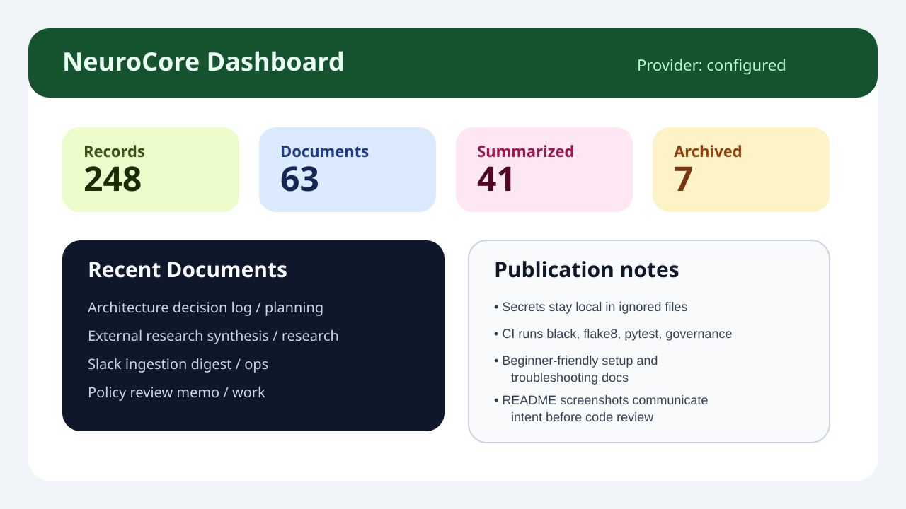

# NeuroCore Community

[](LICENSE)
[](https://www.python.org/downloads/)
[](https://github.com/Shiva108/NeuroCore_community/actions/workflows/repo-gate.yml)

NeuroCore Community is the public, contributor-friendly edition of NeuroCore.
It ships the public package source, tests, docs, and contribution surfaces from
the active development repo without the private operator state, local secrets,
or internal-only working files.

The active architecture and scope contract lives in [`docs/ssd/`](docs/ssd/).
Keep README-level guidance aligned with those documents when behavior changes.

**Version:** `0.1.0`  
Declared in [pyproject.toml](pyproject.toml).

## Overview

Main capabilities currently present in the public repository:

- capture notes, documents, and imported source material into durable memory
- query stored content with metadata filters and optional semantic ranking
- manage first-class brain manifests plus session and protocol workflows
- generate synthesized briefings and consensus-style report flows
- expose the same core behavior through library, CLI, HTTP, and MCP surfaces
- run SQLite, mirror, or Postgres-backed storage paths behind shared contracts
- validate repo metadata and scan for obvious secret-like values
- provide contribution surfaces for recipes, skills, integrations, dashboards,
  schemas, primitives, and curated extensions

## Quick Start

The default bootstrap path is the mirror-first bootstrap script using the
security operator profile:

```bash
python scripts/bootstrap.py
source .venv/bin/activate
```

That flow creates or reuses `.venv`, installs `.[dev,semantic]`, writes an
operator-home env file under `~/.local/state/neurocore/`, copies the local-only
config templates into that operator home, and runs `pytest` plus repo
validation unless you pass `--skip-verify`.

Local-only SQLite remains available as an explicit fallback when you do not
want the default mirror path.

For a guided setup:

```bash
python scripts/bootstrap.py --wizard
```

For the checkout-safe CLI wrapper:

```bash
python scripts/neurocore_checkout.py diagnose
python scripts/neurocore_checkout.py capture --request-json '{"bucket":"research","content":"community repo note","content_format":"markdown","source_type":"note"}'
python scripts/neurocore_checkout.py query --request-json '{"query_text":"community repo","namespace":"default","allowed_buckets":["research"],"sensitivity_ceiling":"standard"}'
```

## Screenshots

Repository overview:



Dashboard preview:



## Repository Structure

```text
.
├── src/neurocore/        # Core package, adapters, storage, retrieval, reporting
├── tests/                # Pytest suite grouped by subsystem
├── scripts/              # Bootstrap, checkout, proof, and repo helper scripts
├── assets/               # Banner and screenshots
├── docs/                 # Setup, security, MCP, troubleshooting, and SSD docs
├── dashboards/           # Dashboard contribution surface and templates
├── extensions/           # Curated extension surface and bundle manifests
├── integrations/         # Connector and starter integration examples
├── primitives/           # Reusable building blocks and templates
├── recipes/              # Runnable workflow recipes
├── schemas/              # Checked-in contracts and schema templates
├── skills/               # Skill definitions and templates
├── .claude/commands/     # Repo-local slash-command prompts
└── .github/              # CI workflows, templates, and metadata schemas
```

## Public Docs

- [docs/README.md](docs/README.md) for the docs index
- [docs/setup.md](docs/setup.md) for the full bootstrap and manual setup flow
- [docs/reference-stack.md](docs/reference-stack.md) for the default local path
- [docs/hosted-stack.md](docs/hosted-stack.md) for the hosted companion path
- [docs/security-workflows.md](docs/security-workflows.md) for security-focused memory workflows
- [docs/security.md](docs/security.md) for publication and runtime hygiene
- [docs/mcp/CODEX.md](docs/mcp/CODEX.md) and [docs/mcp/CLAUDE_CODE.md](docs/mcp/CLAUDE_CODE.md) for local MCP setup

## Validation

Use the repo entrypoints instead of ad hoc commands:

```bash
make test
make lint
make validate
make openapi-check
```

## Security First

Do not commit API keys, local `.env` files, database files, `token.json`,
`secrets.json`, or `preferences.json`.

- Copy `.env.example` into your operator-home env file, not into the repo root.
- Treat `secrets.json.example`, `preferences.json.example`, and
  `ingest-profiles.json.example` as templates only.
- Sanitize provider URLs, headers, and logs before opening issues or sharing
  test output.
- Use [SECURITY.md](SECURITY.md) for vulnerability reporting guidance.

## Troubleshooting

Common setup and runtime issues are documented in
[docs/troubleshooting.md](docs/troubleshooting.md).
