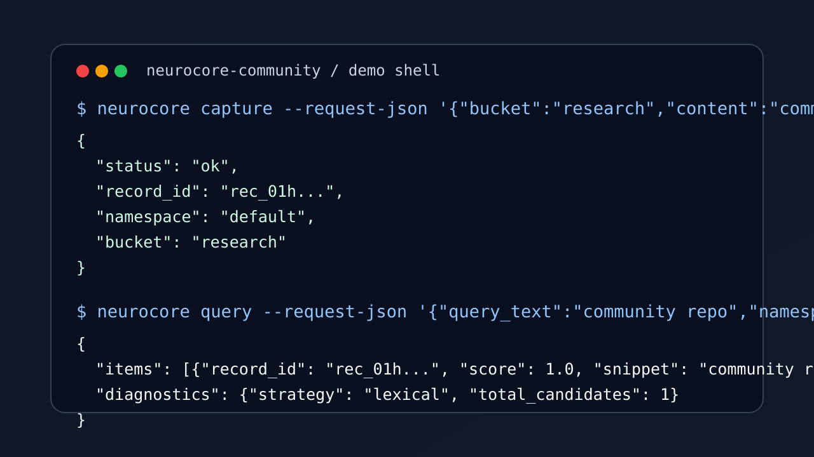
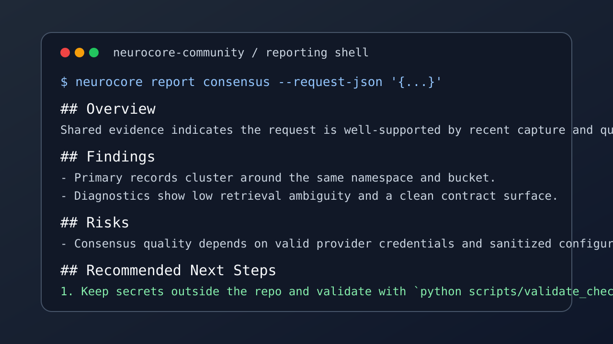

# NeuroCore Community

[](LICENSE)


NeuroCore Community is the public, contributor-friendly edition of NeuroCore: a
Python package for capturing, storing, querying, summarizing, and governing
policy-aware notes and documents.

This repository is intentionally curated from a private development repo. It
ships a clean public history, the core package, tests, community-facing docs,
and a small set of maintenance scripts. It does not attempt to mirror every
private workflow, document, or integration package.

## Highlights

- contract-first Python package under `src/neurocore/`
- CLI, HTTP, and MCP adapters backed by shared interfaces
- automated tests, repo validation, and OpenAPI snapshot checks
- SSD architecture and specification docs under `docs/ssd/`
- beginner-friendly bootstrap flow for local development

## Security First

Do not commit API keys, local `.env` files, database files, `token.json`,
`secrets.json`, or `preferences.json`.

- Copy `.env.example` into your operator-home env file, not into the repo root.
- Treat `secrets.json.example` and `preferences.json.example` as templates only.
- Sanitize provider URLs, headers, and logs before opening issues or sharing
  test output.
- Use the private reporting guidance in [SECURITY.md](SECURITY.md) for
  vulnerabilities. Do not file public security issues.

## Quickstart

```bash
python scripts/bootstrap.py
source .venv/bin/activate
pytest
python scripts/validate_checkout.py
```

Install the package manually if you prefer:

```bash
python -m venv .venv
source .venv/bin/activate
python -m pip install --upgrade pip
python -m pip install -e ".[dev]"
```

If you prefer to run the CLI through the repo-local virtual environment wrapper:

```bash
python scripts/neurocore_checkout.py --help
```

## Example Flow

See [examples/quickstart-cli.md](examples/quickstart-cli.md) for a minimal
capture-and-query walkthrough using the public CLI surface.

```bash
neurocore capture --request-json '{"bucket":"research","content":"community repo note","content_format":"markdown","source_type":"note"}'
neurocore query --request-json '{"query_text":"community repo","namespace":"default","allowed_buckets":["research"],"sensitivity_ceiling":"standard"}'
```

## Demo Screenshots

CLI capture and query flow:



Consensus reporting example:



## Repository Layout

- `src/neurocore/`: package source
- `tests/`: automated test suite
- `scripts/`: local bootstrap and validation helpers
- `schemas/`: checked-in JSON/OpenAPI contracts
- `examples/`: minimal usage walkthroughs
- `docs/`: setup guides, troubleshooting, and SSD contract docs
- `assets/`: README images and lightweight visual assets

## Core Commands

```bash
make test
make lint
make validate
python scripts/generate_openapi_snapshot.py --check
```

Use `black src tests scripts` if you want to apply formatting locally instead of
checking it.

## Documentation

Public-facing setup guides live under [docs/](docs/README.md):

- [Setup Guide](docs/setup.md)
- [Configuration Guide](docs/configuration.md)
- [Troubleshooting](docs/troubleshooting.md)

Public contract docs:

- [Architecture](docs/ssd/architecture.md)
- [Specification](docs/ssd/specification.md)
- [Implementation Plan](docs/ssd/implementation-plan.md)
- [Source Matrix](docs/ssd/source-matrix.md)

## What Is Included

- the `neurocore` Python package under `src/neurocore/`
- automated tests under `tests/`
- SSD architecture and specification docs under `docs/ssd/`
- local development helpers under `scripts/`
- CI, repo validation, and OpenAPI snapshot checks

## What Is Intentionally Excluded

- private Git history and operational artifacts
- personal development workflows and internal planning notes
- specialized hosted proof, replication, and security-operator workflows
- concrete Slack, Discord, or desktop connector packages
- secrets, local runtime state, and provider-specific credentials

## Troubleshooting

Common first-time issues:

- `ModuleNotFoundError: neurocore`: activate `.venv` or reinstall with
  `python -m pip install -e ".[dev]"`.
- config errors on startup: create or refresh the operator-home env file from
  `.env.example`.
- repo validation failures: remove local secrets or runtime artifacts from the
  checkout and rerun `python scripts/validate_checkout.py`.
- OpenAPI snapshot drift: rerun `python scripts/generate_openapi_snapshot.py`
  and commit the updated schema if the contract intentionally changed.

More detail is available in [docs/troubleshooting.md](docs/troubleshooting.md).

## Release Model

This repository is maintained as a public community edition. Public releases are
curated drops from a separate private development repository. Community changes
land here first, then are intentionally ported back when appropriate.

## License

NeuroCore Community is licensed under the [Apache License 2.0](LICENSE).
